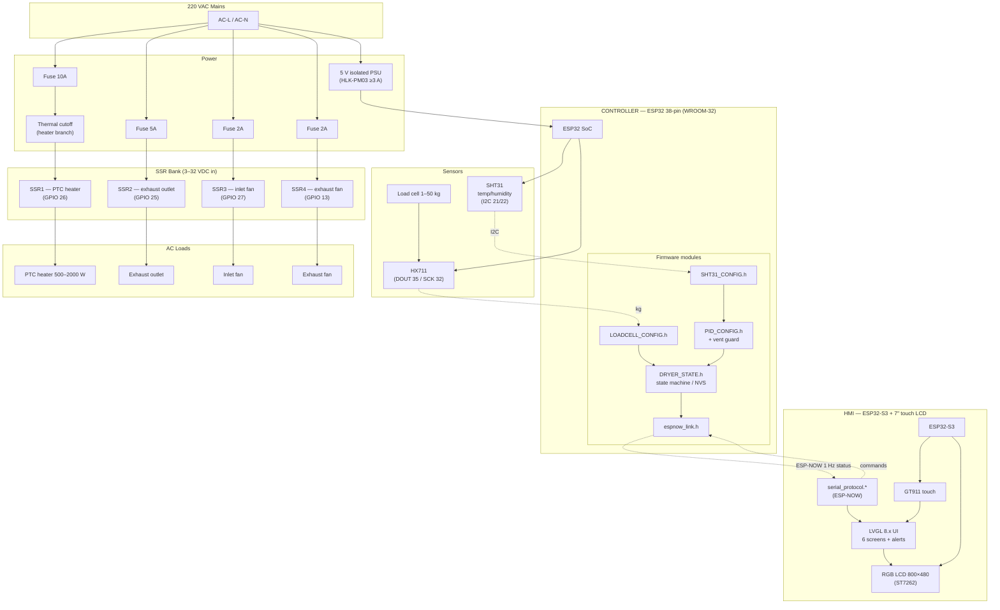

# Block Diagram

System block diagram (Mermaid — renders on GitHub).

## Legend

| Block | Notes |
|---|---|
| Mains | 220 VAC, fused per branch (10/5/2/2 A) |
| PSU | Isolated 5 V; ESP32's onboard regulator makes 3.3 V |
| Thermal cutoff | Mandatory, in series with the PTC heater branch |
| SSR bank | Opto-isolated 3–32 VDC input; firmware forces inputs LOW at boot |
| ESP-NOW | Wireless, channel 1, packed binary packets (see `api/espnow-protocol.md`) |
| Sensors | SHT31 on I2C; HX711 fully digital (no ADC2 dependence) |
