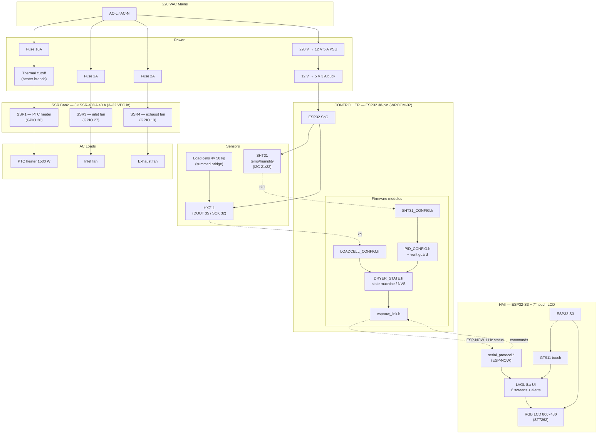

# Block Diagram

System block diagram (Mermaid — renders on GitHub).

## Legend

| Block | Notes |
|---|---|
| Mains | 220 VAC, fused per branch (10/2/2 A) |
| PSU | 220 V → 12 V 5 A PSU + 12 V → 5 V 3 A buck (5 V rail → ESP32; onboard regulator makes 3.3 V) |
| Thermal cutoff | Mandatory, in series with the PTC heater branch |
| SSR bank | 3× SSR-40DA 40 A (SSR1 heater, SSR3 inlet, SSR4 exhaust); opto-isolated 3–32 VDC input; firmware forces inputs LOW at boot |
| ESP-NOW | Wireless, channel 1, packed binary packets (see `api/espnow-protocol.md`) |
| Sensors | SHT31 on I2C; HX711 fully digital (no ADC2 dependence) |
