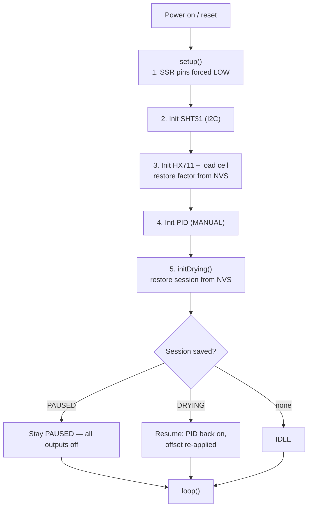
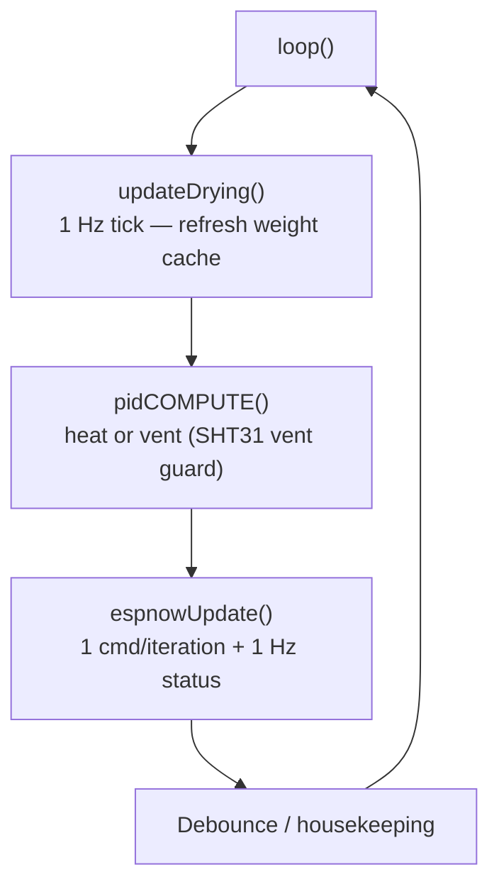
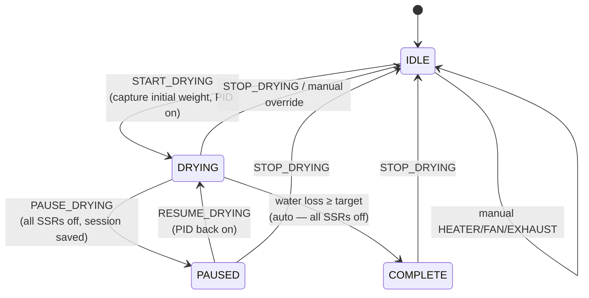
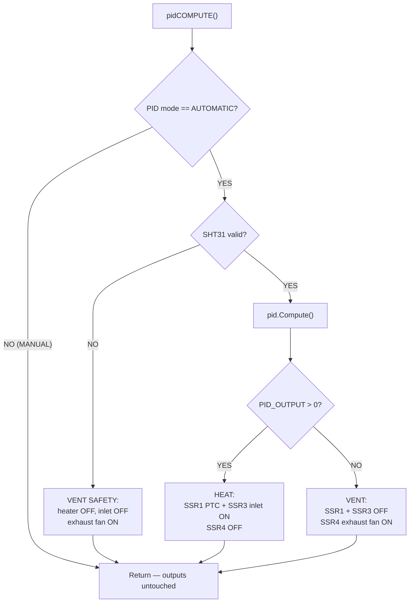
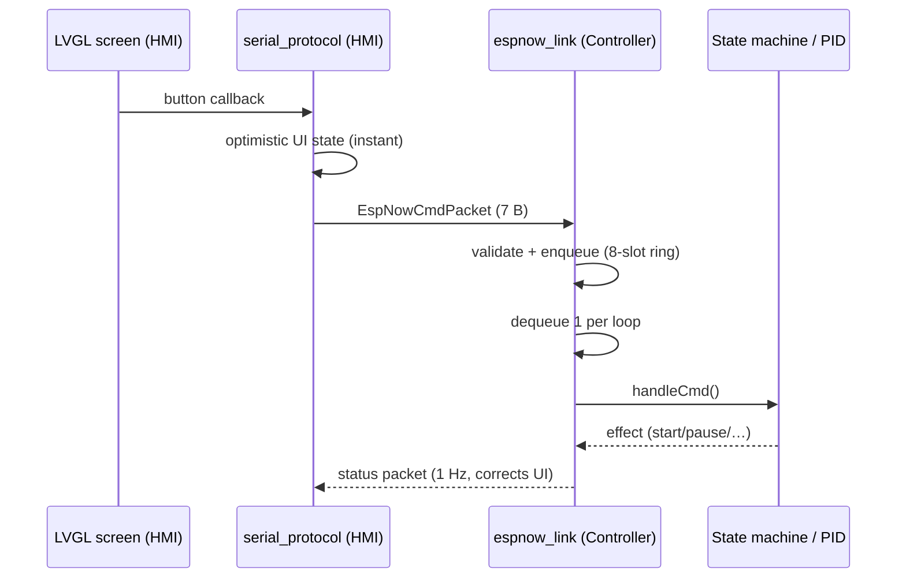

# Flow Charts

Control-flow diagrams (Mermaid — renders on GitHub).

---

## 1. Controller Boot Flow

---

## 2. Main Loop (every iteration)

---

## 3. Drying State Machine

---

## 4. PID + Sensor-Fail Decision

---

## 5. ESP-NOW Command Path (HMI → Controller)

---

> Related: [`../system-architecture.md`](../system-architecture.md) ·
> [`api/espnow-protocol.md`](../api/espnow-protocol.md) ·
> [`guides/bring-up-checklist.md`](../guides/bring-up-checklist.md)
